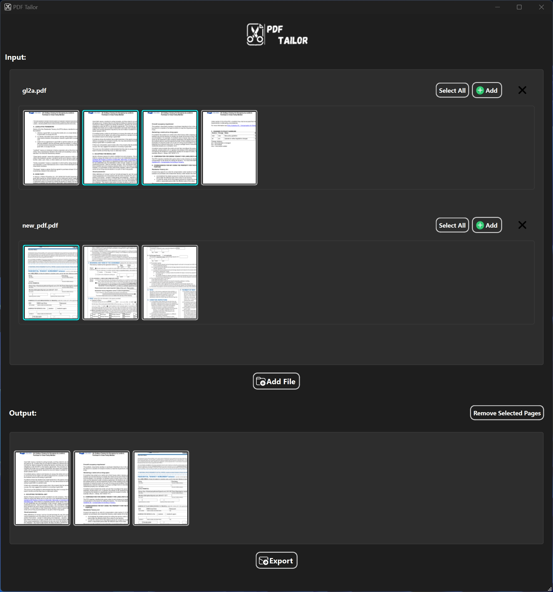

# PDF Tailor

PDF Tailor is a PySide6 application designed to make merging and splitting PDF files simple and secure. Concerned about uploading PDFs containing sensitive personal information to untrustworthy online services? Such websites may store your files, potentially leading to data breaches and compromising your privacy. PDF Tailor offers a secure alternative, allowing you to process all your PDF files locally on your own computer. This ensures that your files never leave your device, providing you with complete control and peace of mind regarding your information. With this app, you can import multiple PDF files, customize them by merging or splitting, and export the newly combined document.



## Features

- **Import Multiple PDF Files**: Add multiple PDF files to create a tailored version.
- **Merge PDFs**: Combine different PDF files into a single document.
- **Split PDFs**: Split a PDF into separate pages or select specific pages to create a new file.
- **Export Tailored PDF**: Save your merged or split version to a new PDF file.

## Requirements

To run PDF Tailor, make sure you have Python installed and then install the dependencies listed in `requirements.txt`.

### Installation

1. Clone the repository or download the source code.

   ```sh
   git clone https://github.com/StevenSong-sTs/PDF-Tailor.git
   cd pdf-tailor
   ```

2. Install the required packages using `pip`:

   ```sh
   pip install -r requirements.txt
   ```

## Usage

Run the application with Python:

```sh
python pdf_tailor.py
```

Follow the on-screen instructions to import, merge, split, and export your PDF files.

## Contributing

Contributions are welcome! Feel free to submit a pull request or open an issue to discuss improvements or new features.

## Contact

If you have any questions or feedback, please contact me at [stevensong0x7cc@gmail.com].
